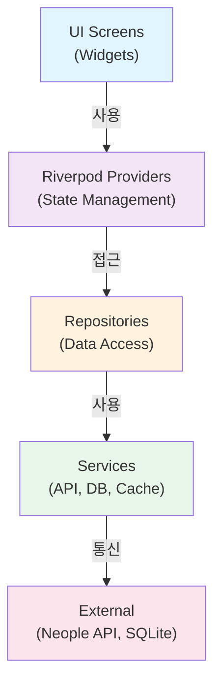

# 던전앤파이터 플래너 — 시스템 아키텍처 설계

확정된 기술 결정을 바탕으로 한 시스템 아키텍처 설계 문서입니다.

---

## 📐 아키텍처 개요

```
┌─────────────────────────────────────────────────────┐
│                 Flutter UI Layer                     │
│  (Screens, Widgets, Forms)                          │
└──────────────────┬──────────────────────────────────┘
                   │
┌──────────────────▼──────────────────────────────────┐
│            MVC Controllers Layer                     │
│  (Business Logic, State Management with Riverpod)  │
└──────────────────┬──────────────────────────────────┘
                   │
┌──────────────────▼──────────────────────────────────┐
│           Models & Data Layer                       │
│  (Entities, DTOs, Repositories)                    │
└──────────────────┬──────────────────────────────────┘
                   │
        ┌──────────┴──────────┐
        │                     │
┌───────▼─────────┐  ┌────────▼────────┐
│  Neople API     │  │  Local Storage  │
│  Client         │  │  (SQLite)       │
│  - HTTP Client  │  │  - CRUD ops     │
│  - Caching      │  │  - Persistence │
└─────────────────┘  └─────────────────┘
```

---

## 🏗️ 계층별 설명

### **1. UI Layer (Presentation)**

**역할**: 사용자 인터페이스 및 상호작용

**주요 컴포넌트**:
```dart
screens/
├── home_screen.dart           # 홈 화면
├── character_search_screen.dart # 캐릭터 검색
├── character_detail_screen.dart # 캐릭터 대시보드
├── planner_screen.dart        # 콘텐츠 플래너
├── enhancement_screen.dart    # 강화 계획
└── activity_log_screen.dart   # 활동 기록

widgets/
├── character_card.dart        # 캐릭터 정보 카드
├── content_item.dart          # 콘텐츠 아이템
├── enhancement_calculator.dart # 강화 계산기
└── progress_bar.dart          # 진행도 바
```

**상태 관리**: Riverpod Providers
```dart
final characterProvider = StateNotifierProvider<...>(...);
final timelineProvider = FutureProvider<...>(...);
final plannerProvider = StateNotifierProvider<...>(...);
```

---

### **2. Controller Layer (Business Logic)**

**역할**: 비즈니스 로직 및 상태 관리 (Riverpod)

**주요 컨트롤러**:
```dart
providers/
├── character_controller.dart   # 캐릭터 조회/저장
├── timeline_controller.dart    # 타임라인 조회 및 매칭
├── planner_controller.dart     # 콘텐츠 플래너 관리
├── enhancement_controller.dart # 강화 계획 계산
└── cache_controller.dart       # 캐시 관리
```

**책임**:
- UI의 요청을 처리
- 모델 조작
- 상태 변경 알림 (Riverpod)
- 비즈니스 로직 구현

---

### **3. Model Layer (Data)**

**역할**: 데이터 관리 및 저장소 접근

```dart
models/
├── character.dart            # 캐릭터 데이터 모델
├── timeline_event.dart       # 타임라인 이벤트
├── content_item.dart         # 콘텐츠 아이템
├── enhancement_plan.dart     # 강화 계획
└── enhancement_rate.dart     # 강화 확률표

repositories/
├── character_repository.dart  # 캐릭터 데이터 접근
├── timeline_repository.dart   # 타임라인 데이터 접근
├── planner_repository.dart    # 플래너 데이터 접근
└── cache_repository.dart      # 캐시 데이터 접근

services/
├── neople_api_service.dart    # API 클라이언트
├── database_service.dart      # SQLite 관리
└── cache_service.dart         # 메모리 캐시 관리
```

---

## 🔄 데이터 흐름

### **시나리오 1: 캐릭터 정보 조회**

```
┌─────────────────┐
│ CharacterSearch │ (UI)
│     Screen      │
└────────┬────────┘
         │ searchCharacter(nickname)
         │
┌────────▼─────────────────┐
│ CharacterController      │ (Controller)
│ (Riverpod Provider)      │
└────────┬─────────────────┘
         │
    ┌────┴─────┐
    │           │
┌───▼──────┐  ┌▼───────────────┐
│  메모리   │  │ API/LocalDB    │
│  캐시     │  │ 조회           │
└──────────┘  └────────────────┘
    │              │
    └──────┬───────┘
           │
    ┌──────▼───────────────┐
    │ CharacterRepository  │ (Model)
    │ - Cache 확인         │
    │ - API 호출           │
    │ - DB 저장            │
    └──────┬───────────────┘
           │
    ┌──────▼──────────────┐
    │ 결과 반환            │
    │ UI 업데이트          │
    └─────────────────────┘
```

### **시나리오 2: 타임라인 자동 감지 (하이브리드)**

```
┌──────────────────┐
│ 플래너 화면      │ (UI)
│ 콘텐츠 추가      │
└────────┬─────────┘
         │
┌────────▼──────────────────────┐
│ PlannerController             │ (Controller)
│ - 콘텐츠 저장                  │
│ - 타임라인 조회 트리거         │
└────────┬───────────────────────┘
         │
┌────────▼──────────────────────┐
│ TimelineRepository            │ (Model)
│ - Neople API 조회              │
│ - 타임라인 데이터 파싱         │
└────────┬───────────────────────┘
         │
┌────────▼──────────────────────┐
│ 하이브리드 매칭 엔진           │
│                               │
│ 1단계: 타임라인 코드 매칭     │
│   IF code 매칭 THEN           │
│     자동 체크                  │
│   ELSE                        │
│     2단계로 진행             │
│                               │
│ 2단계: 메시지 텍스트 매칭     │
│   IF message.contains("콘텐츠") │
│     자동 체크                  │
│   ELSE                        │
│     미감지 표시              │
└────────┬───────────────────────┘
         │
    ┌────▼─────┐
    │ 결과 저장 │
    │ UI 업데이트
    └──────────┘
```

---

## 📁 프로젝트 폴더 구조 (Layer-based)

```
lib/
│
├── main.dart                  # 앱 진입점
│
├── models/                    # 데이터 모델 및 DTO
│   ├── character.dart
│   ├── timeline_event.dart
│   ├── content_item.dart
│   ├── enhancement_plan.dart
│   └── enhancement_rate.dart
│
├── screens/                   # UI 화면
│   ├── home_screen.dart
│   ├── character_search_screen.dart
│   ├── character_detail_screen.dart
│   ├── planner_screen.dart
│   ├── enhancement_screen.dart
│   └── activity_log_screen.dart
│
├── widgets/                   # 재사용 가능한 UI 컴포넌트
│   ├── character_card.dart
│   ├── content_item_widget.dart
│   ├── enhancement_calculator_widget.dart
│   ├── progress_bar.dart
│   └── error_dialog.dart
│
├── providers/                 # Riverpod State Managers
│   ├── character_provider.dart
│   ├── timeline_provider.dart
│   ├── planner_provider.dart
│   ├── enhancement_provider.dart
│   └── cache_provider.dart
│
├── repositories/              # 데이터 접근 계층
│   ├── character_repository.dart
│   ├── timeline_repository.dart
│   ├── planner_repository.dart
│   └── cache_repository.dart
│
├── services/                  # 외부 서비스 통합
│   ├── neople_api_service.dart
│   ├── database_service.dart
│   ├── cache_service.dart
│   └── timeline_matcher_service.dart
│
├── utils/                     # 유틸리티 함수
│   ├── constants.dart         # 상수 (API_URL, etc)
│   ├── extensions.dart        # Dart 확장 메서드
│   ├── logger.dart            # 로깅
│   └── validators.dart        # 데이터 검증
│
└── config/                    # 설정 파일
    ├── theme.dart             # 테마 (색상, 폰트)
    ├── routes.dart            # 라우팅 설정
    └── environment.dart       # 환경 변수
```

---

## 💾 데이터 저장소 설계 (SQLite)

### **테이블 구조**

```sql
-- 캐릭터 정보
CREATE TABLE characters (
  id INTEGER PRIMARY KEY AUTOINCREMENT,
  characterId TEXT UNIQUE NOT NULL,
  nickname TEXT NOT NULL,
  server TEXT NOT NULL,
  jobName TEXT,
  level INTEGER,
  createdAt TIMESTAMP DEFAULT CURRENT_TIMESTAMP,
  updatedAt TIMESTAMP DEFAULT CURRENT_TIMESTAMP
);

-- 타임라인 이벤트 (캐시)
CREATE TABLE timeline_events (
  id INTEGER PRIMARY KEY AUTOINCREMENT,
  characterId TEXT NOT NULL,
  eventCode TEXT,
  message TEXT NOT NULL,
  eventDate TIMESTAMP NOT NULL,
  createdAt TIMESTAMP DEFAULT CURRENT_TIMESTAMP,
  FOREIGN KEY (characterId) REFERENCES characters(characterId)
);

-- 콘텐츠 플래너 항목
CREATE TABLE planner_items (
  id INTEGER PRIMARY KEY AUTOINCREMENT,
  characterId TEXT NOT NULL,
  contentName TEXT NOT NULL,
  contentType TEXT,  -- 'dungeon', 'raid', 'legion' 등
  isCompleted BOOLEAN DEFAULT 0,
  completedAt TIMESTAMP,
  addedAt TIMESTAMP DEFAULT CURRENT_TIMESTAMP,
  updatedAt TIMESTAMP DEFAULT CURRENT_TIMESTAMP,
  FOREIGN KEY (characterId) REFERENCES characters(characterId)
);

-- 강화 계획
CREATE TABLE enhancement_plans (
  id INTEGER PRIMARY KEY AUTOINCREMENT,
  characterId TEXT NOT NULL,
  itemName TEXT NOT NULL,
  currentLevel INTEGER,
  targetLevel INTEGER,
  status TEXT,  -- 'planning', 'in_progress', 'completed'
  createdAt TIMESTAMP DEFAULT CURRENT_TIMESTAMP,
  updatedAt TIMESTAMP DEFAULT CURRENT_TIMESTAMP,
  FOREIGN KEY (characterId) REFERENCES characters(characterId)
);

-- 강화 확률표 (정적 데이터)
CREATE TABLE enhancement_rates (
  id INTEGER PRIMARY KEY AUTOINCREMENT,
  level INTEGER UNIQUE NOT NULL,
  successRate REAL NOT NULL,
  requiredGold INTEGER NOT NULL,
  requiredMaterial TEXT,
  createdAt TIMESTAMP DEFAULT CURRENT_TIMESTAMP
);
```

---

## 🔌 캐싱 전략 (메모리 + 디스크)

### **캐시 흐름**

```
요청
  │
  ├─→ L1: 메모리 캐시 (메모리)
  │   ├─ 존재? → 즉시 반환
  │   └─ 미존재? ↓
  │
  ├─→ L2: 디스크 캐시 (SQLite)
  │   ├─ 존재 & 유효? → 반환 + 메모리에 로드
  │   └─ 미존재 or 만료? ↓
  │
  └─→ L3: API 호출 (원본 소스)
      └─ 결과 저장
         ├─ 메모리 캐시 저장
         └─ 디스크 캐시 저장
```

### **캐시 정책**

| 데이터 | TTL | 저장소 | 갱신 |
|--------|-----|--------|------|
| 캐릭터 정보 | 1시간 | L1 + L2 | 수동 (새로고침) |
| 타임라인 | 30분 | L1 + L2 | 자동 (플래너 추가 시) |
| 강화 확률표 | 7일 | L2만 | 수동 (패치 시) |
| 플래너 항목 | 영구 | L2만 | 실시간 |

---

## 🔄 API 호출 전략 (자동 재시도)

```
API 호출
  │
  ├─ 성공? → 데이터 반환
  │
  └─ 실패? → 재시도
      │
      ├─ 재시도 1차: 1초 대기
      ├─ 재시도 2차: 2초 대기 (exponential backoff)
      ├─ 재시도 3차: 4초 대기
      │
      └─ 모두 실패? → 에러 반환
                    & 로컬 캐시 반환 (만료된 데이터)
```

### **재시도 로직**

```dart
Future<T> withRetry<T>(
  Future<T> Function() operation, {
  int maxRetries = 3,
  Duration initialDelay = const Duration(seconds: 1),
}) async {
  Duration delay = initialDelay;
  
  for (int i = 0; i < maxRetries; i++) {
    try {
      return await operation();
    } catch (e) {
      if (i == maxRetries - 1) rethrow;
      await Future.delayed(delay);
      delay *= 2;  // exponential backoff
    }
  }
}
```

---

## 🎯 타임라인 자동 감지 (하이브리드 매칭)

### **매칭 알고리즘**

```dart
class TimelineMatcherService {
  // 1단계: 타임라인 코드 기반 매칭 (정확도 높음)
  bool matchByCode(TimelineEvent event, PlannerItem item) {
    final codeMap = {
      'dungeon_advanced': ['123001', '123002'],
      'raid_normal': ['124001'],
      'legion': ['125001'],
      // ...
    };
    return codeMap[item.contentType]?.contains(event.code) ?? false;
  }

  // 2단계: 메시지 텍스트 기반 매칭 (폴백)
  bool matchByMessage(TimelineEvent event, PlannerItem item) {
    final keywords = {
      'dungeon_advanced': ['상급던전', '마법사의 성'],
      'raid_normal': ['레이드', 'Normal'],
      'legion': ['레기온'],
      // ...
    };
    return keywords[item.contentType]?.any(
      (keyword) => event.message.contains(keyword)
    ) ?? false;
  }

  // 하이브리드 매칭
  bool matches(TimelineEvent event, PlannerItem item) {
    return matchByCode(event, item) || matchByMessage(event, item);
  }
}
```

---

## 🔒 에러 처리 전략

```
┌──────────────────┐
│ 에러 발생         │
└────────┬─────────┘
         │
    ┌────▼────────────────┐
    │ 에러 타입 판별      │
    └────┬─────┬─────┬───┘
         │     │     │
    ┌────▼─┐ ┌─▼──┐ ┌▼─────┐
    │ API  │ │DB  │ │ Logic│
    │ 에러 │ │에러│ │에러  │
    └────┬─┘ └─┬──┘ └┬─────┘
         │     │     │
    ┌────▼─────▼─────▼────┐
    │ 에러 메시지 표시    │
    │ 사용자 안내         │
    │ 로깅               │
    └────────────────────┘
```

---

## 📊 의존성 관계도



---

## 🎯 핵심 설계 원칙

1. **단일 책임 원칙**: 각 계층은 하나의 책임만
2. **의존성 역전**: 상위 계층은 하위 계층에 의존
3. **테스트 용이성**: Mock 사용 가능하도록 설계
4. **확장성**: 새 기능 추가 시 기존 코드 최소 수정
5. **성능**: 캐싱을 통한 API 호출 최소화

---

## 📝 다음 단계

→ `docs/architecture.md`에서 사람이 읽기 쉬운 버전 작성  
→ `.planning/decisions/ADR-*.md`에서 기술 결정 기록
