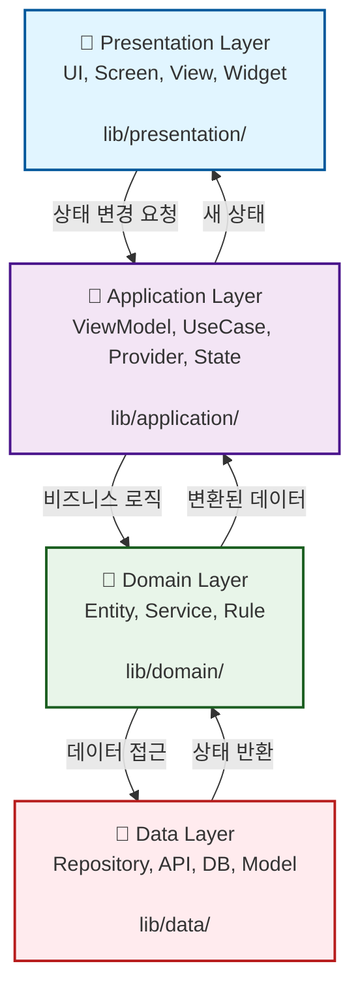

# 아키텍처 — 4-Layer Architecture

던전앤파이터 플래너 앱의 아키텍처는 Clean Architecture의 4-Layer 패턴을 따릅니다.

---

## 📐 4개 계층 구조

### 시각적 계층도



### 텍스트 계층도

```
┌─────────────────────────────────────────────┐
│  🎨 Presentation Layer                      │
│  (UI, Screen, View, Widget)                 │
│  "화면을 그려요"                             │
└────────────────┬────────────────────────────┘
                 ↓ (이벤트 전달)
┌─────────────────────────────────────────────┐
│  🔄 Application Layer                       │
│  (ViewModel, UseCase, Provider, State)      │
│  "상태를 관리해요"                           │
└────────────────┬────────────────────────────┘
                 ↓ (로직 요청)
┌─────────────────────────────────────────────┐
│  💼 Domain Layer                            │
│  (Entity, Service, Rule, UseCase)           │
│  "핵심 규칙을 정해요"                        │
└────────────────┬────────────────────────────┘
                 ↓ (데이터 요청)
┌─────────────────────────────────────────────┐
│  💾 Data Layer                              │
│  (Repository, API, DB, Model)               │
│  "API/DB를 관리해요"                         │
└─────────────────────────────────────────────┘
```

---

## 🏗️ 디렉토리 구조 (파일 위치로 구성)

```
lib/
├── main.dart                           # 앱 진입점
├── app.dart                            # 루트 위젯 (MaterialApp)
│
├── presentation/                       # 🎨 UI 계층 (screens/, widgets/, theme/)
│   ├── screens/
│   │   ├── character_search_screen.dart
│   │   ├── planner_screen.dart
│   │   └── timeline_screen.dart
│   │
│   ├── widgets/
│   │   ├── character_card.dart
│   │   ├── planner_list_item.dart
│   │   ├── timeline_list.dart
│   │   └── search_form.dart
│   │
│   └── theme/
│       ├── app_theme.dart
│       └── colors.dart
│
├── application/                        # 🔄 상태 관리 계층 (view_models/, use_cases/)
│   ├── view_models/
│   │   ├── character_search_vm.dart
│   │   ├── planner_vm.dart
│   │   └── timeline_vm.dart
│   │
│   └── use_cases/
│       ├── search_character_uc.dart
│       ├── update_planned_content_uc.dart
│       └── match_timeline_uc.dart
│
├── domain/                             # 💼 비즈니스 로직 계층 (entities/, services/)
│   ├── entities/
│   │   ├── character.dart
│   │   ├── planned_content.dart
│   │   └── timeline.dart
│   │
│   └── services/
│       ├── character_service.dart
│       └── timeline_service.dart
│
└── data/                               # 💾 외부 데이터 계층 (repositories/, api/, local/)
    ├── repositories/
    │   ├── character_repository.dart
    │   ├── planner_repository.dart
    │   └── timeline_repository.dart
    │
    ├── api/
    │   ├── neople_api_client.dart
    │   ├── models/
    │   │   ├── character_model.dart
    │   │   └── timeline_model.dart
    │   └── services/
    │       └── http_service.dart
    │
    └── local/
        ├── database_service.dart
        ├── models/
        │   └── planned_content_model.dart
        └── migrations/
            └── v1_schema.dart
```

---

## 📊 각 계층별 책임 & 위치 이유

### 1️⃣ Presentation Layer (UI만 담당)
**위치**: `lib/presentation/`

**책임:**
- UI 렌더링
- 사용자 이벤트 감지
- ViewModel에 이벤트 전달

**왜 이 위치에?**
- 🎨 **시각적 요소만 집중**: 파일 수정 시 가장 자주 변경되는 계층
- 👥 **디자이너 협업**: UI/UX 담당자가 쉽게 찾을 수 있음
- 🔍 **명확한 화면 구조**: `screens/` 폴더로 화면별 파일 정리

**금지사항:**
- ❌ 비즈니스 로직 (if문으로 데이터 검증)
- ❌ API 호출 (Http 통신)
- ❌ DB 접근 (데이터 쓰기)

---

### 2️⃣ Application Layer (상태 관리)
**위치**: `lib/application/`

**책임:**
- Riverpod Provider로 상태 관리
- ViewModel에서 UI 이벤트 처리
- Domain 계층(UseCase) 호출
- 로딩/에러 상태 관리

**왜 이 위치에?**
- 🔄 **UI ↔ 비즈니스 로직 중개**: Presentation과 Domain 사이의 '다리' 역할
- 📦 **상태 중앙 집중**: 모든 상태 변경이 여기를 거침
- 🧪 **테스트 용이**: ViewModel만 테스트하면 UI 동작 검증 가능

**역할:**
- Presentation의 "검색 버튼 클릭" → Application의 "searchCharacter() 호출"
- Domain의 "캐릭터 찾음" → Presentation의 "UI 업데이트"

---

### 3️⃣ Domain Layer (비즈니스 로직)
**위치**: `lib/domain/`

**책임:**
- Entity 정의 (Character, PlannedContent, Timeline)
- UseCase 구현
- 타임라인 매칭 알고리즘
- 외부 라이브러리 최소화 (순수 Dart)

**왜 이 위치에?**
- 🧠 **핵심 규칙 집중**: "던전 클리어"란 무엇인가? "플래너 상태"는?
- 🔌 **독립적 테스트**: 외부 의존성 없이 순수 로직만 검증
- 🎯 **프로젝트의 심장**: 앱이 하는 일의 본질이 여기 있음
- 🔄 **재사용성**: 다른 프로젝트에서 Domain 로직 재사용 가능

**예시:**
```dart
// domain/entities/character.dart
class Character {
  final String name;
  final int level;
  
  // 핵심 규칙: "고렙 캐릭터"의 정의
  bool isHighLevel() => level >= 50;
}

// domain/services/timeline_service.dart
class TimelineService {
  // 핵심 규칙: "타임라인 자동 감지" 알고리즘
  Timeline matchDungeonFromTimeline(String timeline) {
    // 실제 매칭 로직...
  }
}
```

---

### 4️⃣ Data Layer (외부 데이터)
**위치**: `lib/data/`

**책임:**
- Neople API 호출
- SQLite 읽고 쓰기
- Model ↔ Entity 변환
- Repository 구현

**왜 이 위치에?**
- 🔌 **외부 의존성 격리**: API/DB가 변경되어도 다른 계층은 영향 X
- 🔄 **변환 담당**: API 응답 (Model) → 앱 내부 형식 (Entity)
- 📱 **Repository 패턴**: "데이터가 어디서 왔는지" 캡슐화
- 🔐 **보안 민감 정보**: API 키, DB 쿼리 등 한곳에서 관리

**예시:**
```dart
// data/api/neople_api_client.dart
class NeopleApiClient {
  Future<CharacterModel> searchCharacter(String name) async {
    // API 호출 (외부 의존성)
  }
}

// data/repositories/character_repository.dart
class CharacterRepository {
  Future<Character> getCharacter(String name) async {
    final model = await _apiClient.searchCharacter(name);
    // Model → Entity 변환 (내부 형식으로)
    return Character.fromModel(model);
  }
}
```

---

## 🔄 데이터 흐름 & 계층 간 소통

### 캐릭터 검색 예시 (위에서 아래로, 다시 위로)

```
1️⃣ PRESENTATION LAYER (UI)
   ┌─────────────────────────────────┐
   │ User clicks "Search" button     │
   │ CharacterSearchScreen.build()   │
   └─────────────┬───────────────────┘
                 │ ref.read(characterProvider.notifier)
                 │    .searchCharacter(name)
                 ↓
                 
2️⃣ APPLICATION LAYER (상태)
   ┌─────────────────────────────────┐
   │ CharacterSearchVM.searchCharacter│
   │ - 로딩 상태 true로 변경          │
   │ - UseCase 호출                   │
   └─────────────┬───────────────────┘
                 │ await searchCharacterUC.execute(name)
                 ↓
                 
3️⃣ DOMAIN LAYER (비즈니스 로직)
   ┌─────────────────────────────────┐
   │ SearchCharacterUC.execute()     │
   │ - 입력값 검증 (이름 빈칸 아닌가) │
   │ - Repository 호출               │
   └─────────────┬───────────────────┘
                 │ await characterRepository.search(name)
                 ↓
                 
4️⃣ DATA LAYER (외부 데이터)
   ┌─────────────────────────────────┐
   │ CharacterRepository.search()    │
   │ - API 호출: Neople API          │
   │ - 응답 받기: CharacterModel     │
   │ - Model → Entity 변환           │
   │ - DB 저장: SQLite               │
   └─────────────┬───────────────────┘
                 │ return Character(...)
                 ↓

← 역방향 (데이터 반환) ←

3️⃣ DOMAIN: 데이터 검증 & 비즈니스 로직 적용
   ↓
2️⃣ APPLICATION: 상태 업데이트 (로딩 false, 데이터 저장)
   ↓
1️⃣ PRESENTATION: UI 자동 갱신 (Riverpod 반응성)
   ↓
   CharacterCard 표시 (이름, 직업, 레벨)
```

### 핵심 원칙: 단방향 의존성

```
Presentation → Application → Domain → Data
    ↑                                   ↓
    └───────────────────────────────────
       (데이터는 아래에서 위로 반환)
```

**각 계층은 "자신보다 아래" 계층에만 의존:**
- ✅ Presentation은 Application 호출 (OK)
- ✅ Application은 Domain 호출 (OK)
- ✅ Domain은 Data 호출 (OK)
- ❌ Presentation이 Data를 직접 호출 (금지!)
- ❌ Data가 Application을 알아야 함 (금지!)

---

## ❓ 자주 묻는 질문

**Q: `character.dart`가 domain에 있는 이유는?**  
A: 캐릭터의 "본질"(이름, 레벨)을 정의하기 때문. API 응답 형식(Model)과 앱 내부 형식(Entity)을 분리하려고.

**Q: CharacterModel과 Character의 차이는?**  
A: 
- `Character` (domain) = 순수 데이터 + 검증 로직 (앱이 알아야 할 형식)
- `CharacterModel` (data/api) = API 응답 형식 (Neople API의 JSON 구조)

**Q: 왜 Repository가 필요한가?**  
A: "데이터가 어디서 왔는지"를 숨기기 위해. 추후 API → DB로 변경해도 Application은 몰라도 됨.

**Q: ViewModel이 StateNotifier인가?**  
A: 정확히는 StateNotifier<State> 형태. Riverpod에서 상태를 관리하는 방식.

**Q: domain/services/와 data/api/services/의 차이는?**  
A:
- `domain/services/` = 비즈니스 로직 (타임라인 매칭 알고리즘)
- `data/api/services/` = 기술적 구현 (HTTP 요청 보내기)

---

## 📚 구조 요약표

| 계층 | 폴더 | 주요 파일 | 역할 | 의존성 |
|-----|------|---------|------|--------|
| **Presentation** | `lib/presentation/` | screens/, widgets/, theme/ | UI 표시 | Application에 의존 |
| **Application** | `lib/application/` | view_models/, use_cases/ | 상태 관리 | Domain에 의존 |
| **Domain** | `lib/domain/` | entities/, services/ | 비즈니스 규칙 | 외부 의존 없음 (순수) |
| **Data** | `lib/data/` | repositories/, api/, local/ | 데이터 접근 | 외부 API/DB 사용 |

---

## 🔍 이 구조를 검증하는 방법

**1. 파일이 올바른 위치에 있는가?**
```bash
# 각 폴더에 정말 필요한 파일만 있는지 확인
lib/presentation/    # .dart 파일들 (UI만)
lib/application/     # ViewModel 파일들 (상태)
lib/domain/         # Entity, Service (순수 로직)
lib/data/           # Repository, API, DB (외부 통신)
```

**2. 계층 간 의존성이 단방향인가?**
```bash
# 이 명령으로 검증 가능 (grep 사용)
grep -r "import.*domain" lib/data/       # ❌ 불가능
grep -r "import.*data" lib/domain/       # ❌ 불가능
grep -r "import.*application" lib/data/  # ❌ 불가능
```

**3. 금지 사항이 지켜졌는가?**
- Presentation에서 http import? ❌
- Application에서 Widget import? ❌
- Domain에서 package: 외부 라이브러리 import? ❌

---

**작성일**: 2026-05-18  
**버전**: 1.0 (11주차 완성)  
**패턴**: 4-Layer Clean Architecture  
**상태 관리**: Riverpod (ADR-0001)  
**DB**: SQLite (ADR-0002)  
**API**: Neople API  

**다음 검토**: 12주차 실제 구현 시작 후 (구조 재확인)
