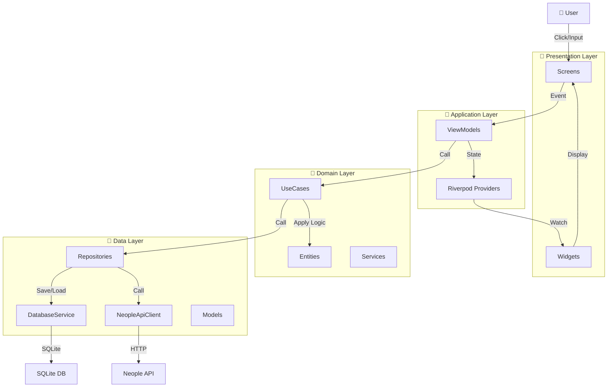
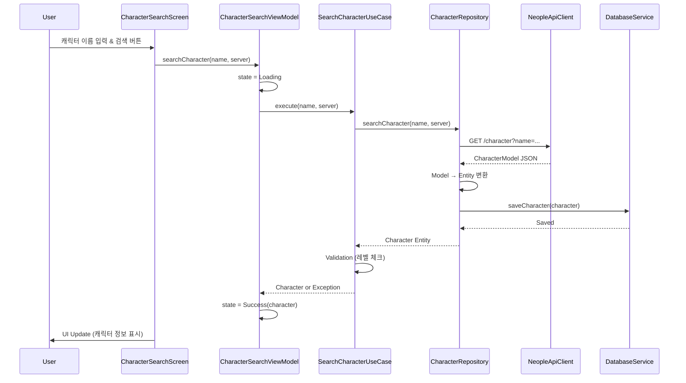
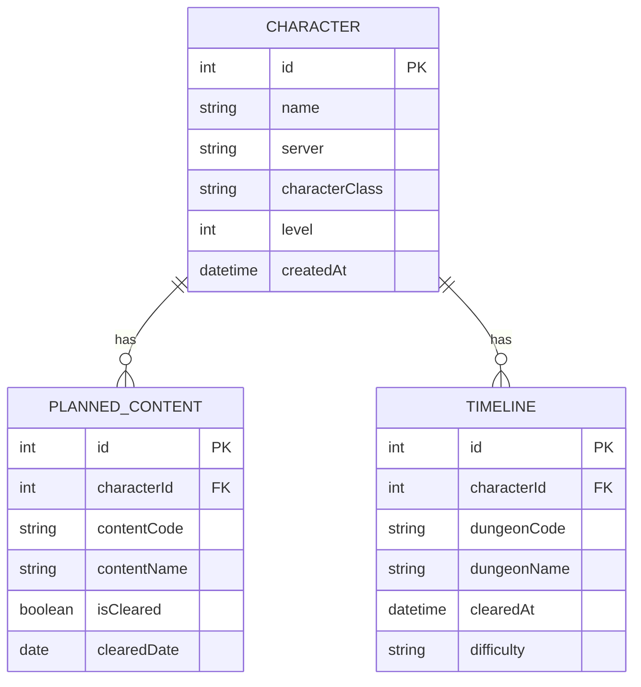

# 아키텍처 다이어그램

## 1. 4-Layer 전체 구조



---

## 2. 캐릭터 검색 플로우



---

## 3. 데이터 모델 매핑

```mermaid
graph LR
    subgraph API["API Response (JSON)"]
        JSON["{ id, name, server, class, level }"]
    end
    
    subgraph Model["Data Model (API ↔ DB)"]
        CharacterModel["CharacterModel.fromJson()"]
    end
    
    subgraph Entity["Domain Entity"]
        Character["Character (Business Logic)"]
    end
    
    JSON -->|Deserialize| CharacterModel
    CharacterModel -->|toDomain()| Character
    Character -->|toModel()| CharacterModel
    CharacterModel -->|toJson()| JSON
```

---

## 4. 파일 생성 로직

```
1️⃣ Presentation 계층
   └─ CharacterSearchScreen
      ├─ searchForm 위젯 렌더링
      ├─ 사용자 입력 감지
      └─ ViewModel.searchCharacter() 호출

2️⃣ Application 계층
   └─ CharacterSearchViewModel (StateNotifier)
      ├─ 상태: isLoading, character, error
      ├─ 이벤트: searchCharacter()
      └─ UseCase.execute() 호출

3️⃣ Domain 계층
   ├─ Character Entity (name, level, etc + isHighLevel())
   ├─ CharacterService (비즈니스 규칙)
   └─ SearchCharacterUseCase
      ├─ Repository 호출
      ├─ Entity 검증
      └─ 결과 반환

4️⃣ Data 계층
   ├─ CharacterRepository
   │  ├─ NeopleApiClient 호출 → CharacterModel
   │  ├─ DatabaseService로 저장
   │  └─ Model → Entity 변환 반환
   │
   ├─ NeopleApiClient
   │  └─ HTTP 요청 → Neople API
   │
   ├─ DatabaseService
   │  └─ SQLite 읽/쓰
   │
   └─ CharacterModel (JSON 변환)
```

---

## 5. 플래너 데이터 관계도



---

## 6. 의존성 흐름

```
Application Layer depends on:
├─ Riverpod (상태 관리)
├─ Domain (비즈니스 로직)
└─ Data (데이터 접근)

Domain Layer depends on:
└─ 외부 라이브러리 최소 (순수 Dart)

Data Layer depends on:
├─ http (API)
├─ sqflite (Database)
├─ json_serializable (JSON)
└─ path_provider (파일 경로)

Presentation Layer depends on:
├─ Flutter (UI)
├─ Riverpod (상태 감시)
└─ Domain (Entity 표시)

❌ 역의존성 금지:
  - Data는 Domain을 모름
  - Domain은 Application을 모름
  - 모든 계층은 Presentation을 모름
```

---

**다이어그램 작성일**: 2026-05-18  
**아키텍처 버전**: v1.0  
**참고**: ADR-0003 (MVC), ADR-0002 (SQLite), ADR-0001 (Riverpod)
